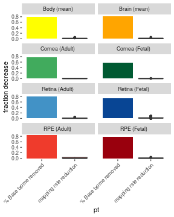
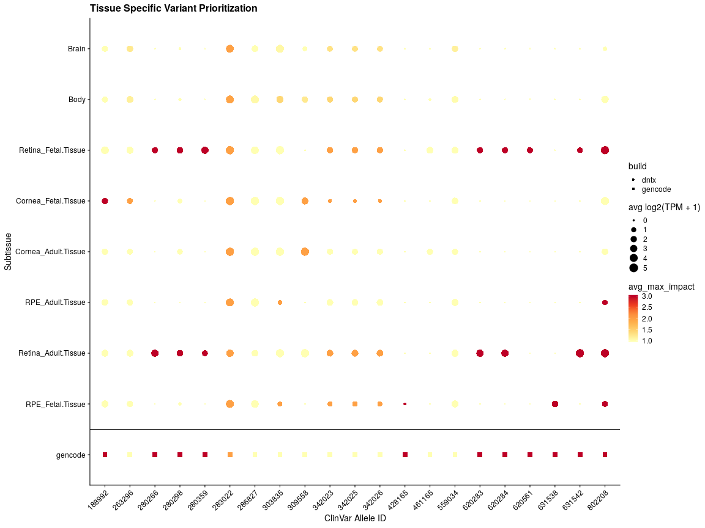
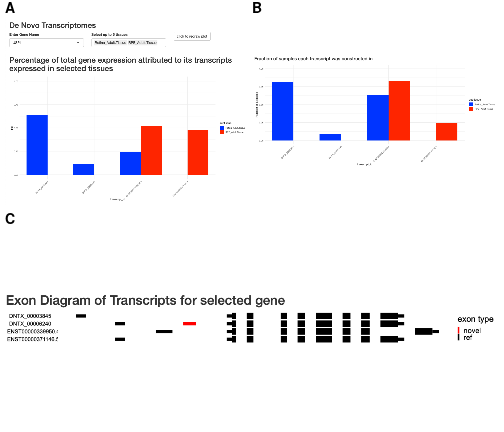

<div class="redoc" id="redoc-codechunk-1">


</div>


<div class="redoc" id="redoc-codechunk-2">


</div>

# Introduction

|        The transcriptome is defined as the set of distinct RNA transcripts expressed in a population of identical cells. During transcription of a gene several RNA processing steps modify immature RNA and drive the formation of multiple, distinct gene isoforms. For example the human Gencode release 28 contains 97,713 protein conding transcripts across 20,306 genes. RNA processing contains a variety of biological mechanisms and includes alternative promoter usage, alternative splicing, RNA editing, and alternative polyadenylation. The full biological impact of gene isoforms has not been fully elucidated, but multiple studies have shown that gene isoforms can have distinct and critical functions in biologcial processes like development<span class="redoc" id="redoc-citation-1">[-@dykes_hic2_2018]</span>, cell differentiation<span class="redoc" id="redoc-citation-2"><span class="redoc" id="redoc-citation-10">[-@trapnell_transcript_2010]</span></span>, and cell migration<span class="redoc" id="redoc-citation-3">[-@mitra_splicing_2020]</span>. Alternative usage of isoforms has also been implacted in multiple diseases including cancer<span class="redoc" id="redoc-citation-4">[-@vitting-seerup_landscape_2017]</span>, cardiovascular disease<span class="redoc" id="redoc-citation-5">[-@noauthor_titin_nodate]</span>, alzheimers<span class="redoc" id="redoc-citation-6">[-@mills_rna-seq_2013]</span> and diabetic retiopathy<span class="redoc" id="redoc-citation-7">[-@perrin_diabetic_2005]</span>.(didnt read these papers so need to double check them)

|        Before there was an established human transcriptome, there were many studies centered around finding novel isoforms of genes. These were generally low throughput experiments examining one gene driving the formation of its isoforms.(?Include  transitions to RNAdseq ie est-> microarray-> RNA-seq) RNA-seq has been used as a powerful tool for the complicated task of detecting of novel gene isoforms. Early methods using RNA-seq to find novel gene isoforms focused on identifying looking for novel exon-exon junctions and novel exon boundriesm, based on RNA-seq coverage alone.<span class="redoc" id="redoc-citation-8">[-@nagalakshmi_transcriptional_2008]</span>  More recently, researchers have developed specialized algorithmns to use RNA-seq to reconstruct the whole transcriptome of a biological samples, dubbed *de novo* transcriptome construction <span class="redoc" id="redoc-citation-9"><span class="redoc" id="redoc-citation-28">[-@haas_novo_2013]</span></span>,[-@trapnell_transcript_2010],<span class="redoc" id="redoc-citation-11"><span class="redoc" id="redoc-citation-12"><span class="redoc" id="redoc-citation-23">[-@pertea_stringtie_2015]</span></span></span>.
        
|        *de novo* transcriptome construction uses short (~100bp) RNA-seq reads to reconstruct full-length mRNA transcripts. This is a particularly useful method because it can detect novel starts and ends with the need for specialized sequencing. Something abour how it was used successfully,abyss, trinity, cufflinks. One major flaw is that a large number of samples are required to combat the noisy nature of RNA-seq data, but because of the increasingly inexpensive sequencing, data sets of the necessary size are now available. For example,  The most comprehensive *de novo* transcriptome project to date has been CHESS, which used the GTEx dataset to construct *de novo* transcriptomes in over 9000 RNA-seq samples from 49 distinct location of the body to create a comprehensive annotation of mRNA transcripts across the human body. [-@pertea_stringtie_2015],<span class="redoc" id="redoc-citation-13">[-@gtex_consortium_genetic_2017]</span>,<span class="redoc" id="redoc-citation-14">[-@pertea_chess_2018]</span> However, as the GTEx dataset lacks any ocular tissues, the CHESS database is an incomplete annotation of the human transcriptome.

|        Despite the increasing number of tools for transcriptome construction there has been no gold standard with which to evaluate precision and sensitivity of de novo transcriptome construction on real (not simulated) biological data. Long read sequencing technologies provide a potential solution to this problem as long read sequencing can capture full length transcripts and thus can be used to identify a fuller range of gene isoforms diversity. While long reads have historicaly been considered inaccurate, the new PacBio Sequel II system sequences long reads as accurately as short read based seqencing [CITATION]. We propose that long read based transcriptomes can serve as a ground truth for evaluating short-read base transcriptomes, and in this study we use PacBio long read RNA sequencing to inform the construction of short read transcriptomes. We generated PacBio long read RNA seq data from a stem cell derived retinal pigmented epithelium (RPE) cell line along with matched Illumina short read RNA-seq. Using the two sources of RNA-seq data we design a rigorous *de novo* transcriptome pipeline that maximizes the conordance between short and long read *de novo* transcriptomes.

|        We further apply this pipeline to construct a pan eye transcriptome using a previously published data set containing  <span class="redoc" id="redoc-citation-15"><span class="redoc" id="redoc-inlinecode-1">368</span> 368 ocular tissue samples compiled from mining publicly available sequencing data [@swamy_eye_2019]</span>.We use this pipeline to build transcriptomes in three major ocular subtissues: The cornea, retina, and the RPE, using RNA-seq data from both adult and fetal tissues to create a high-quality pan-eye transcriptome. In addition to our ocular samples, we used a subset of the GTEx dataset to construct transcriptomes for 49 other locations across the body to facilitate comparisons in transcriptomes across the body.
|        We use our pan eye *de novo* transcriptome to reveal hundreds of novel gene isoforms as well as several novel genes in the and analyze their potential impact on ocular biology and disease. We provide our *de novo* transcriptomes as a resource to other researchers through an R package and R-shiny webapp.


# Methods 


::: {custom-style="CustomCaption"}
Figure 0. DNTX workflow
:::


## Generation of PacBio long read RNA sequencing data and Ilumina short read RNA sequencing
<library prep>

## Analysis of Long Read Data
|       PacBio hifi reads were processed into full length, non chimeric(FLNC) read using the Pacbio SMRT link software <span class="redoc" id="redoc-citation-16">[VERSION]. We next adapted the ENCODE Long Read analysis pipeline:  Transcripts were aligned to the human genome using the minimap2[-@li_minimap2_2018]</span> with the following parameters. Aligned long reads were processed with TranscriptClean<span class="redoc" id="redoc-citation-17">[-@wyman_transcriptclean_2019]</span> to remove errors due to sequencing. The long read transcriptome was generated with TALON <span class="redoc" id="redoc-citation-18">[-@wyman_technology-agnostic_2020]</span>

## Analysis of short read RPE data 
|       We aligned each sample to the Gencode release 27 (v27) hg38 assembly using the genomic aligner STAR and sorted the resulting BAM files using samtools sort.<span class="redoc" id="redoc-citation-19"><span class="redoc" id="redoc-citation-22">[-@frankish_gencode_2019]</span></span>,<span class="redoc" id="redoc-citation-20">[-@dobin_star_2013]</span>,<span class="redoc" id="redoc-citation-21">[-@li_sequence_2009]</span>. For each sorted BAM file, we constructed a per sample base transcriptome using StingTie with the Gencode V27 comprehensive annotation as a guiding annotation and default parameters.[-@frankish_gencode_2019],[-@pertea_stringtie_2015]. All sample transcriptomes were merged with the long read transcriptome using gffcompare<span class="redoc" id="redoc-citation-24"><span class="redoc" id="redoc-citation-26">[-@pertea_gff_2020]</span></span>. We define the metric construction accuracy sued to evaluate short read transcriptome construction as the following:
$Construction\ Accuracy = \frac {short\ read \ transcriptome\ \cap \ long\ read\ transcriptome} {short\ read \ transcriptome}$

## Construction of tissue specific transcriptomes.

|        We identified studies with healthy, unperturbed RNA-seq samples from <span class="redoc" id="redoc-citation-25"><span class="redoc" id="redoc-inlinecode-2">52</span> distinct subtissue regions of the body, downloaded and performed quality control the pertinent sequencing data from the sequence read archive (SRA) using methods from our previous work[-@swamy_eye_2019]</span>. We constructed a transcriptome for each sample, and merged samples together to create <span class="redoc" id="redoc-inlinecode-3">52</span> tissue specific base transcriptomes. For each tissue-specific transcriptome, we removed transcripts that had an average expression less than 1 TPM. All tissue specific transcriptomes were merged to form a single unified gtf to ensure transcript identifiers were the same across tissues. We additionally merged all ocular tissue transcriptomes to generate a single pan-eye transcriptome.


## Tissue specific transcriptome quantification
|        For each resulting tissue specific transcriptome, we extracted transcript sequences using the tool gffread[-@pertea_gff_2020], and used these sequences to build a tissue-specific quantification index using the index mode of the alignment free quantification tool Salmon using the following parameters: <params>.<span class="redoc" id="redoc-citation-27">[-@patro_salmon_2017]</span> For each sample, we quantified transcript expression using the quant mode of salmon, using a samples respective tissue specific quantification index with the following runtime parameters: --gcBias --seqBias  --validateMappings. We similarly quantified all ocular samples using the pan-eye transcriptome We also similarly quantified all samples to the Gencode v27 reference. 

## Downstream analysis of Novel transcripts 
Analysis of novel exons was done using a custom Rscript [GIVE NAME OF SCRIPT?]. To predict the clinical significance of clinvar variants of uncertain significance, we selected variants from the ClinVar database labeled as "Uncertain Significance", and used Ensembl’s Variant Effect Predictor tool. 


## Identification of protein coding novel transcripts. 

|        We identified protein coding transcripts in our unified transcriptome using the TransDecoder suite.[-@haas_novo_2013] We extracted transcript sequences using the util script gtf_genome_to_cdna_fasta.pl and used TransDecoder to find a single best open reading frame from each transcript.We used the agat_sp_add_start_stop.pl scripts from the AGAT tool to identify start and stop codons for each ORF. Transcripts with no detectable ORF or missing a start or stop codon were marked as noncoding. 

## Prediction of novel loci function 
Protein coding novel loci were compared to the uniprot protein sequence data base using blastp<span class="redoc" id="redoc-citation-29">[-@altschul_basic_1990]</span>. Blastp results were integrated with hmmer<cite>, which identified protein families and domains associated with each novel loci


## Computing Resources
|        All computation was performed on the National Institutes of Health cluster compute system Biowulf.

## Code availability.
|        To improve reproducibility, we wrote all code used to generate both the data and figures for this paper as Snakemake pipelines.<span class="redoc" id="redoc-citation-30">[-@koster_snakemakescalable_2012]</span> All code used for this projecgt is publicly available in the following github repositories: https://github.com/vinay-swamy/ocular_transcriptomes_pipeline - main pipeline, 
https://github.com/vinay-swamy/ocular_transcriptomes_longread_analysis - long read analysis pipeline,
https://github.com/vinay-swamy/ocular_transcriptomes_paper - figures and table for this paper, 
https://github.com/vinay-swamy/ocular_transcriptomes_shiny - webapp;
. [WE NEED TO MOVE THESE TO DAVIDs REPOS]

## Figures and Tables
|        All statistical analyses, figures and tables were generated using the R programming language.<span class="redoc" id="redoc-citation-31">[-@r_core_team_r_2019]</span> A full list of packages and versions can be found in supplementary file session_info.txt. Additionally, all parameters used for commandline tools can be found in supplementary file Snakefile.


# Results 

## Long Read Pacbio RNA sequencing guides *de novo* transcriptome construction
In order to determine the accuracy of short read transcriptome construction, we first generated PacBio long read RNA-seq data and Illumina short read RNA-seq data from a stem cell derived RPE cell line. These cell lines were cultured using a highly optimized protocol, and thus should have minimal biological variation. We used this sequencing data to contruct a long read transcriptome and a short read transcriptome. In our long read transcriptome we find <span class="redoc" id="redoc-inlinecode-4">1163239</span> distinct transcripts, and in our short read transcriptome <span class="redoc" id="redoc-inlinecode-5">366889</span> distinct transcripts 

<div class="redoc" id="redoc-codechunk-3">

```r
plot_violin <- function(ldf, origin){
  ldf <- ldf %>% filter(`Transcript Origin` == origin)
  sum_counts <- ldf%>% 
    mutate(intersection_case = gsub('stringtie', 'StringTie', intersection_case),
           intersection_case = gsub('pacbio', 'PacBio', intersection_case),
           intersection_case = gsub('StringTie-PacBio', 'PacBio &\nStringTie', intersection_case)) %>% group_by(intersection_case, `Transcript Origin`) %>% count()
  violin_plot <- ldf %>% 
    mutate(intersection_case = gsub('stringtie', 'StringTie', intersection_case),
           intersection_case = gsub('pacbio', 'PacBio', intersection_case),
           intersection_case = gsub('StringTie-PacBio', 'PacBio &\nStringTie', intersection_case)) %>% 
    ggplot() +
    scale_y_continuous(breaks = c(2000,4000,6000, 8000, 10000)) +
    geom_text(data = sum_counts, aes(x=intersection_case, y = 11000, label=n), stat= 'identity') +
    geom_violin(aes(x=intersection_case,y=length)) + geom_hline(yintercept = 2000, color='red') +
    cowplot::theme_cowplot() + ylab(glue('{origin}\nTranscript Length (bp)')) + xlab('') + coord_flip(ylim = c(0,11500)) 
  return(violin_plot)
}
violin_plot_novel <- plot_violin( length_df_plotting, 'Novel')
violin_plot_gencode <- plot_violin(length_df_plotting, 'Gencode')
tpm_exp_plot <-  ggplot(data = tpm_df_plotting %>% ungroup, aes(x=co, y=acc, color=`Length Interval`)) + 
  geom_point() + 
  geom_line()+
  #xlim(c(-3,26))+
  #ylim(c(0,1.3))+
  #geom_label_repel(data = labdf_plotting%>% ungroup, aes(x=co, y=y, label = total_tx), fill='white', color='black', nudge_x = -1.5, nudge_y = .25) +
  labs(label = 'asf')+
  ylab('Build Accuracy\n(StringTie ∩ PacBio / StringTie)') +
  xlab('TPM threshold')  +
  facet_wrap(~filtering_type) +
  cowplot::theme_cowplot() +
  scale_color_viridis_d()

violin_plot_novel/violin_plot_gencode/tpm_exp_plot +plot_annotation(tag_levels = 'A') + plot_layout(heights = c(1,1,1.7))
```

<!-- -->

</div>

::: {custom-style="CustomCaption"}
Figure 1. Transcript construction length is substantially larger in the long-read based approach. A) Intersection of transcript lengths between Pacbio (long read) and Stringtie (short read) transcriptomes. The total number of contructed transcripts is given in the text to the right of the violin plot.  B) Short read contruction accuracy stratified by transcript length at different TPM based transcript exclusion thresholds.
:::

|     In our initial comparison between short and and long read transcriptomes, we see a low transcriptome contruction accuracy (see Methods) of <span class="redoc" id="redoc-inlinecode-6">0.207962081174415</span>. When examining the transcript lengths of each build we see that the two methods show very different transcript length distributions for both novel and previously annotated transcripts, with the short read build comprised mostly of smaller transcripts (Fig 1A) [PUT IN MEDIAN AND MEAN]. As the PacBio data was generated using two libraries for 2000 bp and >3000 bp (need to double check this), we expected to see enrichment for longer transcripts in the pacbio.(sup fig 1) To assess accuracy relative to transcript length, we group transcripts by length in 1000 bp intervals, and compare accuracy between each group. We found the accuracy significantly improves for transcripts longer than 2000 bp, with construction accuracy <span class="redoc" id="redoc-inlinecode-7">0.426</span>, and <span class="redoc" id="redoc-inlinecode-8">0.137</span> for transcripts below 2000 bp
|     We experimented with various methods to remove spurious transcripts to improve construction accuracy. We first removed transcripts that were not expressed at 1 TPM in at least one sample as outlined in the stringtie's recomended protocol.<span class="redoc" id="redoc-citation-32">[-@pertea_transcript-level_2016]</span>This acheived <span class="redoc" id="redoc-inlinecode-9">0.475</span> for transcripts longer than 2000bp, and 
 <span class="redoc" id="redoc-inlinecode-10">0.212</span> for transcripts shorter than 2000bp. As this accuracy was still fairly low, we tried other filtering schemes, before settling on keeping transcripts that had an average of 1 TPM expression across all short read samples. This achieved a build accuracy of <span class="redoc" id="redoc-inlinecode-11">0.772</span> and retatining <span class="redoc" id="redoc-inlinecode-12">48470</span> transcripts. In our downstream pipeline we keep transcripts that have an average TPM of at least one across all samples of the same subtissue type. 

## A rigorous analysis pipeline finds thousands of novel gene isoforms

<div class="redoc" id="redoc-codechunk-4">

```r
df <- sample_table %>% 
  left_join(core_tight) %>% 
  filter(!body_location %in% c('Body', 'Brain', 'ESC_Stem.Cell.Line', 'Lens_Stem.Cell.Line')) %>%
  group_by(subtissue) %>%
  summarise(`Samples` = n(), `Studies` = length(unique(study))) %>% 
  arrange(desc(`Studies`)) %>% 
  inner_join(tx_counts %>% select(subtissue, `Transcriptome Count`=filtered)) %>% 
  mutate(subtissue=gsub('_|\\.',' ', subtissue)) %>% 
  mutate(subtissue = gsub(' Tissue', '', subtissue)) %>% 
  separate(subtissue, into  = c('Tissue' , 'Source'), sep = ' ')
```

```
## Joining, by = "sample"
```

```
## `summarise()` ungroup (override with `.groups` argument)
```

```
## Joining, by = "subtissue"
```

```r
kable(df)
```


Tissue   Source    Samples   Studies   Transcriptome Count
-------  -------  --------  --------  --------------------
Retina   Adult         105         8                 38961
RPE      Fetal          49         7                 41641
Cornea   Adult          43         6                 43897
Retina   Fetal          89         6                 50584
RPE      Adult          48         4                 27877
Cornea   Fetal           6         2                 57712

</div>


::: {custom-style="CustomCaption"}
Table 1. Ocular sample dataset overview  and transcriptome size. Transcriptome size is defined as the number of unique transcripts expressed in a given tissue type
:::

|       We built transcriptomes from <span class="redoc" id="redoc-inlinecode-13">368</span> published, publicly available ocular tissue RNA-seq samples using an efficient snakemake pipeline (sup fig 1). We include both adult and fetal tissue from cornea, retina, and RPE tissues mined from <span class="redoc" id="redoc-inlinecode-14">29</span> different studies (Table 1). Our fetal tissues consist of both human fetal tissues and human induced pluripotent stem cell (iPSC) derived tissue, as stem cell derived tissue has been show to closely resemble fetal tissue.[CITATIONS]. To more accurately determine tissue specificity of novel ocular transcripts, we supplemented our ocular data set with <span class="redoc" id="redoc-inlinecode-15">877</span> samples across <span class="redoc" id="redoc-inlinecode-16">46</span> body locations from the GTEx project and constructed transcriptomes for each of these body locations. We refer to each distinct body location as a subtissue here after.
|       After initial construction of transcriptomes, we found <span class="redoc" id="redoc-citation-33"><span class="redoc" id="redoc-inlinecode-17">203835</span> previously annotated transcripts  and ZZZ novel transcripts detected in at least one of our <span class="redoc" id="redoc-inlinecode-18">1245</span> samples. We define novel as any region of the human genome that has not been previously annotated within the Gencode, Ensembl and Refseq annotation databases. After using the filtering methods desribed above, our final transcriptome across all tissues contains <span class="redoc" id="redoc-inlinecode-19">285741</span>[THIS IS WRONG] distinct transcripts with <span class="redoc" id="redoc-inlinecode-20">88045</span> previously annotated and <span class="redoc" id="redoc-inlinecode-21">197696</span> novel transcripts, and incudes <span class="redoc" id="redoc-inlinecode-22">29.868408</span> megabases of previously unannotated genomic sequence. [-@frankish_gencode_2019]</span>,<span class="redoc" id="redoc-citation-34">[-@zerbino_ensembl_2018]</span>,<span class="redoc" id="redoc-citation-35">[-@oleary_reference_2016]</span>.
|       We split novel transcripts are into two categories: novel isoforms, which are novel variations of known genes, and novel loci, which are previously unreported, entirely novel regions of transcribed sequence. Novel isoforms are further classified by the novelty of its encoded protein: an isoform with novel open reading frame, a novel isoform with a known ORF, and isoforms with no orf as noncoding isoforms. The number of distinct ORFs is significantly less than the number of transcripts, with <span class="redoc" id="redoc-inlinecode-23">41201</span> previously annotated ORFs and <span class="redoc" id="redoc-inlinecode-24">26593</span> novel ORFs across all tissues. Across all tissues there is an average of <span class="redoc" id="redoc-inlinecode-25">5585.9</span> novel isoforms and <span class="redoc" id="redoc-inlinecode-26">1510.81</span> novel ORFs.

<div class="redoc" id="redoc-codechunk-5">

```r
novel_isoforms_per_tissue <- inner_join(novel_transcripts_per_tissue, novel_orfs_per_tissue) %>% 
  select(-novel_pc_count) %>% 
  gather(key = 'transcript_type', value = 'counts', -body_location, -color) %>% 
  filter(!body_location %in% c('Lens_Stem.Cell.Line', 'ESC_Stem.Cell.Line')) %>% 
  mutate(body_location_pretty=gsub('_|\\.', ' ', body_location),
         body_location_pretty=gsub('Tissue','', body_location_pretty),
         body_location_pretty=gsub('avg','mean', body_location_pretty),
         body_location_pretty=gsub('\\(',' (', body_location_pretty),
         body_location_pretty=gsub('Adult','(Adult)', body_location_pretty),
         body_location_pretty=gsub('Fetal','(Fetal)', body_location_pretty)) %>% 
  mutate(transcript_type = gsub('_',' ', transcript_type),
         transcript_type = gsub(' count', '', transcript_type),
         transcript_type = gsub('nc','NC', transcript_type),
         transcript_type = gsub('orf','ORF', transcript_type),
         transcript_type = gsub('novel','Novel', transcript_type),
         transcript_type = gsub('ref','Ref.', transcript_type))
```

```
## Joining, by = c("body_location", "color")
```

```r
novel_loci_per_tissue <- novel_loci_per_tissue %>% 
  gather(key = 'transcript_type', value = 'counts', -body_location, -color) %>% 
  filter(!body_location %in% c('Lens_Stem.Cell.Line', 'ESC_Stem.Cell.Line')) %>% 
  mutate(transcript_type = gsub('_\\w+','', transcript_type),
         transcript_type = gsub('noncoding' ,'Noncoding', transcript_type),
         transcript_type = gsub('pc','Protein\nCoding', transcript_type)) %>% 
  mutate(body_location_pretty=gsub('_|\\.', ' ', body_location),
         body_location_pretty=gsub('avg','mean', body_location_pretty),
         body_location_pretty=gsub('Tissue','', body_location_pretty),
         body_location_pretty=gsub('\\(',' (', body_location_pretty),
         body_location_pretty=gsub('Adult','(Adult)', body_location_pretty),
         body_location_pretty=gsub('Fetal','(Fetal)', body_location_pretty))
color_list<- novel_isoforms_per_tissue$color
names(color_list) <- novel_isoforms_per_tissue$body_location_pretty
```

</div>

<div class="redoc" id="redoc-codechunk-6">

```r
loci <- ggplot(data = novel_loci_per_tissue) +
  geom_col(aes(x=body_location_pretty, y=counts, fill = body_location_pretty, alpha = transcript_type), position = 'dodge') +
  scale_fill_manual(values = color_list, 'Body\nLocation') +
  scale_alpha_discrete(range=c(.5,1), name = 'Transcript\nType') +
  #ggtitle('Novel Isoforms Contructed Across the Body')+
  ylab('Novel\nTranscript\nCount')+
  xlab('Body Location')+
  cowplot::theme_cowplot() + 
  theme(axis.text.x=element_blank(), panel.background = element_blank())
```

```
## Warning: Using alpha for a discrete variable is not advised.
```

```r
isotype_per_tissue <- ggplot(data = novel_isoforms_per_tissue) +
  geom_col(aes(x=transcript_type, y=counts, fill = body_location_pretty), position = 'dodge') +
  scale_fill_manual(values = color_list) +
  scale_alpha_discrete(range=c(.5,1)) +
  #ggtitle('Novel Isoforms Contructed Across the Body')+
  ylab('Noncoding Transcript Count')+
  xlab('')+
  cowplot::theme_cowplot() + theme(legend.position = "none") + 
  theme(axis.text.x=element_text(angle=45, hjust = 1), panel.background = element_blank())+
  facet_wrap(~body_location_pretty, ncol=2)
```

```
## Warning: Using alpha for a discrete variable is not advised.
```

```r
novel_transcript_types <-  novel_isoform_anno_df %>% filter(label != 'Protein Coding') %>% 
  mutate(group = 'Transcript Type') %>% 
  rename(`Transcript Type` = label) %>% 
  ggplot(data = ., aes(x = group, fill = `Transcript Type`, y=count)) +
  geom_bar(position = 'fill',stat = 'identity') +
  geom_text(aes(label = count), position = position_fill(vjust=.5)) +
  ylab('% of all novel transcripts') +
  cowplot::theme_cowplot() + 
  theme(panel.background = element_blank(), axis.title.x = element_blank())

novel_exon_types <- exon_type_by_transcript_type %>% group_by(nv_type_rc) %>% 
  summarise(count = n()) %>% 
  mutate(group =  'Novel Exon Type') %>% 
  rename(`Novel Exon Type` = nv_type_rc) %>% 
  ggplot(data = ., aes(x = group, fill = `Novel Exon Type`, y=count)) +
  geom_bar(position = 'fill',stat = 'identity') +
  geom_text(aes(label = count), position = position_fill(vjust=.5)) +
  ylab('% of all novel transcripts') +
  cowplot::theme_cowplot() +
  theme(panel.background = element_blank(), axis.title.x = element_blank())
```

```
## `summarise()` ungroup (override with `.groups` argument)
```

```r
exon_type_tx_plot <- exon_type_by_transcript_type %>% 
  mutate(comp_transcript_type = gsub('Isoform', 'Isoform,\n', comp_transcript_type)) %>% 
  mutate(nv_type_rc = gsub('_',' ', nv_type_rc),
         nv_type_rc = gsub('novel', 'Novel', nv_type_rc)) %>% 
  group_by(comp_transcript_type, nv_type_rc) %>% 
  summarise(count = n()) %>% 
  ggplot(data=., aes(x  = comp_transcript_type,y=count, fill = nv_type_rc)) +
  geom_bar(position = 'fill', stat = 'identity')+
  geom_text(aes(label = count), position = position_fill(vjust=.5)) +
  ylab('Proportion of Transcripts') +
  cowplot::theme_cowplot() +
  theme(axis.text.x=element_text(angle=45, hjust = 1), 
        panel.background = element_blank(), axis.title.x = element_blank()) +
  scale_fill_manual(values = pals::cols25() %>% unname(), name = 'Transcript\nCategory')
```

```
## `summarise()` regrouping by 'comp_transcript_type' (override with `.groups` argument)
```

```r
layout <- '
AB
AC
'
isotype_per_tissue + loci + exon_type_tx_plot +plot_annotation(tag_levels = 'A') +plot_layout(design = layout, heights = c(1,5), widths = c(1.5,1), guides = 'collect') 
```

<!-- -->

</div>

::: {custom-style="CustomCaption"}
Figure 2. Overview of Novel Isoforms. A. Number of novel gene isoforms, grouped by transcript type. Brain and body represent an average of 13 and 34 distinct subtissues, respectively B. Novel protein coding and noncoding loci. Novel exon composition of novel isoforms, by isoform type labels indicate number of transcripts.
:::

|        Novel isoforms occur due to an ommission of a previously annotated exon, commonly refered as exon skipping or the addition of a previously annanotated or novel exon. We further classify novel exons by the biological process that may be driving their formations: alternatie promoter usage driving the addition on novel first exons, alternative polyadenylation driving the addition of novel terminal exons, and alternative splicing driving the formation of all novel exons that are not the first or last exon. We further classify alternatively spliced exons into their commonly seen patterns, alternative 5' splice site(A5SS), alternative 3' splice site (A3SS), and retained intron. We note that all three of these mechanisms can lead to exon skipping, so for simplicity we group all novel isoforms resulting from exon skipping together. (considering adding a sup fig with diagrams of each group to make it easier for ppl)


We found that the majority of novel exons with our dataset are novel first and last exons. We see that the majority of A5SS exons lead to novel protein coding isoforms, where as novel TES/TSS more often lead to noncoding isoforms. Retained introns mostly commonly predicted to lead to a novel open reading frame.

## *de novo* transcriptomes reduce overall transcriptome sizes

<div class="redoc" id="redoc-codechunk-7">

```r
map_rate_diffs <- all_sample_mapping_rate_difference %>%
  filter(!body_location %in% c('Lens_Stem.Cell.Line', 'ESC_Stem.Cell.Line')) %>%
  mutate(body_location_pretty=gsub('_|\\.', ' ', body_location),
         body_location=case_when(body_location == 'Body' ~ 'Body(mean)',
                                 body_location == 'Brain'~ 'Brain(mean)' ,
                                 TRUE ~ body_location),
         body_location_pretty=gsub('_|\\.', ' ', body_location),
         body_location_pretty=gsub('avg','mean', body_location_pretty),
         body_location_pretty=gsub('Tissue','', body_location_pretty),
         body_location_pretty=gsub('\\(',' (', body_location_pretty),
         body_location_pretty=gsub('Adult','(Adult)', body_location_pretty),
         body_location_pretty=gsub('Fetal','(Fetal)', body_location_pretty),
         mapping_rate_diff = mapping_rate_diff * -1 ,
         mapping_rate_diff = replace(mapping_rate_diff, mapping_rate_diff <=0, 0),
         pt = 'mapping rate reduction')

size_reduction_df  <-  inner_join(gencode_tx_size, tx_counts) %>%
  mutate(percent_txome_size_decrease = ( all_exp-filtered) / all_exp) %>%
  inner_join(subtissue_to_bodyloc) %>%
  filter(!body_location %in% c('Lens_Stem.Cell.Line', 'ESC_Stem.Cell.Line')) %>%
  mutate(body_location_pretty=gsub('_|\\.', ' ', body_location),
         body_location=case_when(body_location == 'Body' ~ 'Body(mean)',
                                 body_location == 'Brain'~ 'Brain(mean)' ,
                                 TRUE ~ body_location)) %>% 
  mutate(body_location_pretty=gsub('_|\\.', ' ', body_location),
         body_location_pretty=gsub('avg','mean', body_location_pretty),
         body_location_pretty=gsub('Tissue','', body_location_pretty),
         body_location_pretty=gsub('\\(',' (', body_location_pretty),
         body_location_pretty=gsub('Adult','(Adult)', body_location_pretty),
         body_location_pretty=gsub('Fetal','(Fetal)', body_location_pretty)) %>% 
  group_by(body_location_pretty) %>%
  summarise(percent_txome_size_decrease = mean(percent_txome_size_decrease)) %>%
  mutate(pt = '% Base txome removed')
```

```
## Joining, by = "subtissue"
## Joining, by = "subtissue"
```

```
## `summarise()` ungroup (override with `.groups` argument)
```

```r
cl<- novel_transcripts_per_tissue$color
names(cl) <- novel_transcripts_per_tissue$body_location
ggplot(map_rate_diffs) +
  geom_boxplot(aes(x = pt, y = mapping_rate_diff, fill = body_location_pretty))+
  geom_col( data = size_reduction_df, aes(x = pt, y=percent_txome_size_decrease, fill = body_location_pretty)) +
  scale_fill_manual(values = color_list, ) +
  theme(axis.text.x=element_text(angle=45, hjust = 1), panel.background = element_blank()) +
  facet_wrap(~body_location_pretty, ncol = 2) +
  ylab('fraction decrease') +
  theme(legend.position = "none")
```

<!-- -->

</div>

::: {custom-style="CustomCaption"}
Figure 3. Comparison of Salmon mapping rate decrease vs transcriptome size decrease. Any gain in mapping rate has been set to 0 for simiplicity
:::

|       Our transcriptomes removed on average of <span class="redoc" id="redoc-inlinecode-27">79.004</span> % of the a tissue's base transcriptome. We define base transcriptome for a tissues as any transcript in the gencode annotation with non zero TPM in at least one sample of a given tissue type. As this was a strikingly large reduction in transcriptome size, we wanted to ensure we were not unduly throwing away data. We quantified transcript expression of our samples using Salmon, quantifiying each sample twice: once using the gencode V27 human transcript annotation, and once using its associated tissue specific transcriptome We found that despite the <span class="redoc" id="redoc-inlinecode-28">79.004</span> % reduction in number of transcripts between the base gencode and denovo transcriptomes, there is only an average decrease of <span class="redoc" id="redoc-inlinecode-29">0.198</span> % in mapping rate, indicating that majority of gene expression data is preserved.  

## *de novo* transcriptomes identify of the tissue specific primary isoform expressed in a tissue

|     It is useful researchers to know which isoform of a gene is the most relecant to a particular biological system. The APPRIS project identified principal isoforms for humans, based on predicted function and evolutionary conservation, using multiple computational tools. Principal isoforms are considered the most phenotypically relevant isoforms of transcripts. We instead propose a tissue specific primary isoforms, defined as the highest expressed isoforms of a given gene in a given tissue. As primary isoforms are based on biological evidence via RNA-seq, we reason that it is more refined than APPRIS principal isoforms.

<div class="redoc" id="redoc-codechunk-8">

```r
primary_isoforms_per_tissue <- primary_isoforms_per_tissue %>%
  mutate(primary_isoform_origin = gsub('dntx','DNTx', primary_isoform_origin),
         primary_isoform_origin = gsub('gencode', 'GENCODE', primary_isoform_origin),
         primary_isoform_origin = gsub('appris', 'APPRIS', primary_isoform_origin)) %>% 
  mutate(primary_isoform_origin = factor(primary_isoform_origin, levels = c('DNTx', 'GENCODE', 'APPRIS'))) %>% 
  inner_join(subtissue_to_bodyloc) %>%
  filter(!body_location %in% c('Lens_Stem.Cell.Line', 'ESC_Stem.Cell.Line')) %>%
  mutate(body_location_pretty=gsub('_|\\.', ' ', body_location),
         body_location_pretty=case_when(body_location == 'Body' ~ 'Body(mean)',
                                        body_location == 'Brain'~ 'Brain(mean)' ,
                                        TRUE ~ body_location)) %>% 
  mutate(body_location_pretty=gsub('_|\\.', ' ', body_location),
         body_location_pretty=gsub('avg','mean', body_location_pretty),
         body_location_pretty=gsub('Tissue','', body_location_pretty),
         body_location_pretty=gsub('\\(',' (', body_location_pretty),
         body_location_pretty=gsub('Adult','(Adult)', body_location_pretty),
         body_location_pretty=gsub('Fetal','(Fetal)', body_location_pretty)) %>% 
  group_by(body_location_pretty, primary_isoform_origin) %>%
  summarise(count = mean(count)) %>% 
  arrange()
```

```
## Joining, by = "subtissue"
```

```
## `summarise()` regrouping by 'body_location_pretty' (override with `.groups` argument)
```

```r
ggplot(data = primary_isoforms_per_tissue, aes(x = body_location_pretty, y=count, fill = primary_isoform_origin))+
  geom_bar(position = 'fill', stat = 'identity')+
  geom_text(aes(label = as.integer(count) ), position = position_fill(vjust=.5)) +
  cowplot::theme_cowplot() +
  theme(axis.text.x=element_text(angle=45, hjust = 1), panel.background = element_blank()) +
  scale_fill_brewer(palette = 'Set1', name = 'Origin') + ylab('Ratio') + xlab('')
```

<!-- -->

</div>

::: {custom-style="CustomCaption"}
Figure 4. APPPRIS principal isoforms within the *de novo* transcriptome
:::

|    We found that <span class="redoc" id="redoc-inlinecode-30">0.7805</span> of the APPRIS principal isoforms are also identified as the primary isoform in at least one tissue type. Within each tissue type, on average  <span class="redoc" id="redoc-inlinecode-31">0.671</span> % of are an appris primary isoform, <span class="redoc" id="redoc-inlinecode-32">0.245</span>  of transcripts were a previously annotated gencode transcript, <span class="redoc" id="redoc-inlinecode-33">14242.846</span> [THIS IS WRONG] %  of principal isoforms are novel isoforms. 


## Novel Isoforms in Ocular tissues 

<div class="redoc" id="redoc-codechunk-9">

```r
source('scripts/R_raincloud.R')
plot_list <- novel_eye_tx_by_tissue[!names(novel_eye_tx_by_tissue) %in% c('Lens_Stem.Cell.Line', 'ESC_Stem.Cell.Line') ]
all_tx <- tibble(transcript_id = reduce(plot_list, union))
plot_df <- bind_cols(all_tx, lapply(plot_list, function(x) all_tx$transcript_id%in% x))
FIG_FONT_SIZE=12

colnames(plot_df) <- gsub('_|\\.', ' ', colnames(plot_df) )                             
colnames(plot_df) <- gsub('Adult', '(Adult)', colnames(plot_df) )
colnames(plot_df) <- gsub('Fetal', '(Fetal)', colnames(plot_df) )
colnames(plot_df) <- gsub('Tissue', '', colnames(plot_df) )


us <- ComplexUpset::upset(data = plot_df, 
                          intersect = colnames(plot_df)[-1], 
                          min_size= 500, 
                          set_sizes = F,
                          #height_ratio = .8, 
                          #width_ratio = .1,
                          wrap = T,
                          stripes = c('white','white'),
                          base_annotations = list(
                            'Intersection size' = intersection_size(text_colors = c(on_background='red', on_bar='red'))
                          ),
                          themes=upset_modify_themes(
                            list(
                              "intersections_matrix"= theme(text = element_text(size=FIG_FONT_SIZE) ),
                              "Intersection size"= theme(text = element_text(size=FIG_FONT_SIZE),
                                                         panel.grid.major = element_blank(), 
                                                         panel.grid.minor = element_blank()),
                              "overall_sizes"= theme(axis.text.x=element_text(angle=45),text = element_text(size=FIG_FONT_SIZE) ),
                              "default"= theme(text = element_text(size=FIG_FONT_SIZE)) 
                            )
                          )
                          
)

plotting_piu_df <- piu_df %>% mutate(new_stage=ifelse(stage == 'adult', 'Adult', 'Fetal'), 
                                     subtissue=paste0(tissue, '_', new_stage, '.Tissue')) %>% 
  mutate(subtissue=gsub('_|\\.', ' ', subtissue),
         subtissue=gsub('avg','mean', subtissue),
         subtissue=gsub('Tissue','', subtissue),
         subtissue=gsub('\\(',' (', subtissue),
         subtissue=gsub('Adult','(Adult)', subtissue),
         subtissue=gsub('Fetal','(Fetal)', subtissue))

piu <- ggplot(data=plotting_piu_df, aes(x=stage, y=piu, fill=subtissue, color=subtissue)) + 
  geom_flat_violin(position = position_nudge(x = .2, y = 0),adjust = 2)+
  geom_point(position = position_jitter(width = .15), size = .25, alpha=.2) + 
  geom_boxplot(outlier.shape = NA, alpha = 1, width = .1, colour = "BLACK")+ 
  scale_fill_manual(values = color_list) +
  scale_color_manual(values = color_list) +
  ylab('piu')+xlab('tissue')+coord_flip()+ 
  cowplot::theme_cowplot()+ facet_wrap(~tissue, nrow = 3) +
  theme(legend.position = "none")

us + piu  + plot_layout(widths = c(2,1)) + plot_annotation(tag_levels  = 'A') & theme(plot.tag = element_text(size= FIG_FONT_SIZE), text = element_text(size = FIG_FONT_SIZE))
```

<!-- -->

</div>

::: {custom-style="CustomCaption"}
Figure 5. Analysis of novel isoform characteristics A. Set intersection of novel isoforms in ocular transcriptomes. B Boxplots of PIU  overlaid over PIU data points with estimated distribution of data set above each boxplot 
:::

|       Next, we analyzed the novel isoforms within our ocular transcriptomes. We compared the overlap in constructed novel isoforms across ocular tissues and found that XXX % of novel isoforms are specific to a singular ocular subtissue (Fig 3A), but there are significant transcripts clusters for pan-eye and fetal-like tissues as well. For each novel isoform we then calculated percent isoform usage (PIU), or the fraction of total gene expression a transcript contributed to its parent gene. We found that on average novel isoforms contribute to 15% of their parent gene’s expression, although we see multiple novel isoforms that are the primary isoform for their parent gene.

<div class="redoc" id="redoc-codechunk-10">

```r
# ## Novel Loci in the ocular transcriptome
# 
# We determined the longest ORF’s for each novel loci, and for each transcript with a valid ORF, predicted the function the encoded protein using hmmer searching within the pfam databse, and blastp searching within the swissprot database. We chose to hmmer results that had a sequence match e-value < 1e-4, and blastp results with e-value < 1e-15 (Sup Table). We found XXX distinct potentially novel coding loci from blast and hmmer combined. We highlight one detected in fetal RPE
# library(patchwork)
# 
# cov <- ggplot(cov_df, aes(x=coord,y=cov, group = sample))+
#   geom_line( alpha = .3)+
#   geom_area(alpha = .3)+
#   #ggtitle(paste(txid, s_st))+
#   theme(axis.title.x = element_blank(), panel.background = element_blank(), 
#         axis.text.x = element_blank(), axis.ticks.x = element_blank())
# pt <- ifelse(gene_model_df$strand[1] == '+',62, 60)
# model <- ggplot(gene_model_df)+
#   geom_rect(aes(xmin=xmin, xmax=xmax, ymin=ymin, ymax=ymax))+
#   geom_rect(xmin=min(gene_model_df$xmin), xmax=max(gene_model_df$xmax), ymin=-.1, ymax=.1)+
#   geom_point(data=point_df, aes(x = x, y=y), shape= pt, size = 5)+
#   xlab('genome') +
#   ylab(element_blank())+
#   theme(panel.background = element_blank(), axis.text.y = element_blank(), axis.ticks.y = element_blank())
# layout <- '
# AA
# AA
# AA
# AA
# AA
# AA
# BB
# CC
# CC
# '
# mss <- as_ggplot(rasterGrob(readPNG('clean_data/plots/msa_ex.png'), interpolate = T))
# cov/model/mss + plot_layout(design = layout) +plot_annotation(tag_levels = 'A')
# 
# ::: {custom-style="CustomCaption"}
# Figure 6. DNTX000dddd, potentially protein coding novel isoform in Fetal RPE. A) RNA-seq coverage of exons across 49 samples. B transcript model of DNTX000ddd. thick regions represtn coding region. C. Multiple sequence alignment of DNTX000ddd and closely related proteins.
# :::
# 
# Placeholder figure, still trying to find the right transcript to look at here.
```

</div>
## *de novo* transcriptome allow for a more precise variant prioritaizaion. 

The prediction of variants's biological impact is a fundamental step in variant prioritzation, especially in the diagnosis of genetic diseases or in interpreting GWAS results. We use our Ensembl's Variant Effect Predictor combined with our tissue transcriptomes to generate a tissue specific prediction of variant impact for variants of unknown significance(VUS) the clinvar database. We grouped different predicted consequences into a High, moderate and low impacts, and provide a full mapping of biological consequence to impact in our supplementary data.

<div class="redoc" id="redoc-codechunk-11">

```r
library(tidyverse)
cl <- c('Low' = 'lightblue', 'Moderate' = 'lightgreen', 'High' = 'red')
shp <- c('dntx'=16, 'gencode'=15)
k <- vep_plot_df %>% 
  filter(!as.character(subtissue) %in% c('Lens_Stem.Cell.Line', 'ESC_Stem.Cell.Line')) %>% 
  left_join(subtissue_to_bodyloc) %>% mutate(body_location = replace_na(body_location, 'gencode') %>% factor(levels = c('gencode', eye_tissues, 'Body', 'Brain'))) %>% group_by(body_location, allele_id, build) %>% 
  summarise(`avg log2(TPM + 1)` = mean(`log2(TPM + 1)`), avg_max_impact =mean(max_impact) )
```

```
## Joining, by = "subtissue"
```

```
## `summarise()` regrouping by 'body_location', 'allele_id' (override with `.groups` argument)
```

```r
ggplot(k, aes(x =allele_id, y=body_location))+
  geom_point(aes(size = `avg log2(TPM + 1)`, color = `avg_max_impact`, shape=build))+
  scale_color_gradientn(colors =RColorBrewer::brewer.pal(n=6,name = 'YlOrRd'))+
  #scale_color_gradientn(colors=rev(viridisLite::viridis(10)))+
  scale_shape_manual(values = shp)+
  geom_hline(yintercept = 1.5)+
  ylab('Subtissue')+
  xlab('ClinVar Allele ID')+
  ggtitle('Tissue Specific Variant Prioritization') +
  cowplot::theme_cowplot() +
  theme(axis.text.x.bottom = element_text(angle = 45, hjust = 1), panel.background = element_blank())
```

<!-- -->

</div>

::: {custom-style="CustomCaption"}
Figure 7. Tissue specific variant prioritization of variants associated with ocular disease. Size corresponds to average TPM and color to impact. A full mapping of variant descriptors to impact can be found in supplemental data. DROP LENS? Collapse GTEx into brain, not brain?? Clean up formatting (underscores and periods).
:::

We compared out tissue specific variant effect predictions to variant effect predictions using the gencode annotation. We found that out <span class="redoc" id="redoc-inlinecode-34">226824</span> total variants examined,the highest priority of <span class="redoc" id="redoc-inlinecode-35">117556</span> decreased in at least one tissue, and <span class="redoc" id="redoc-inlinecode-36">1075</span> increased in at least one tissue. We see a larger decrease in predicted effects as the transcript which previously lead to an effect is not expressed in a respective tissue. We next selected variants that were associated with ocular disease phenotypes, to see if there were any interesting changes. Variant 280266(what ID is this??), associated retinitis pigmentosa, while considered high impact in gencode as well, its only high impact in adult retina, so more likely to be causative. Variant 843125 associated with retinal pigmentary distrophy, as a high gencode impact, and is high impact in other tissues, low impact and not expressed in any ocular tissue, so likely not disease causing. 

## A companion visualization tool enables easy use of *de novo* transcriptomes 

<div class="redoc" id="redoc-codechunk-12">

```r
piu <- as_ggplot(rasterGrob(readPNG('clean_data/plots/piu_shiny_app.png'), interpolate = T))
frac_det <- as_ggplot(rasterGrob(readPNG('clean_data/plots/frac_sample_det.png'), interpolate = T))
gene_body <- as_ggplot(rasterGrob(readPNG('clean_data/plots/gene_bodies_shiny_app.png'), interpolate = T))
layout <- '
AABB
CCCC
'
piu + frac_det + gene_body + plot_layout(design = layout)+ plot_annotation(tag_levels = 'A')
```

<!-- -->

</div>

::: {custom-style="CustomCaption"}
Figure 8. Screenshots from dynamic *de novo* transcriptome visualization tool. A).  PIU bar plot for selected gene and tissue. B). Exon level diagram of transcript body Thicklines represent coding region of transcript. novel exons colored in red. Tooltip contains genomic location and phylop score C) Bargraph of fraction of samples within dataset each transcript was consructed in by tissue.
:::

|        To make our results easily accessible, we designed a webapp for visualizing and accessing our *de novo* transcriptomes. Users start by selecting gene or search for a gene by genomic location, and selecting up to 5 tissues to visualize transcript expression in. For each tissue we show the PIU for each transcript associated with a gene. We show the exon-intron structure of each transcript and mousing over exons show genomic location overlapping SNPs, and phylogentic conservation score. We additionally show a barplot of the fraction of samples in each tissue each transcript was constructed in. Users can also download the *de novo* transcriptomes for selected tissues in GTF and fasta format.	Short mention of how DNTx is in eyeIntegration now.

## A easy-to-use pipeline to enable future research
Finally, we package all tools used for out transcriptome pipeline within a portable docker container with a stand-alone run script. This pipeline allows other researchers to run their own samples, and generate figures and annotations similar to what is shown here. (havent worked it out entirely, but snakemake can automatically use a singulaity container, so if I provide a singularity image anyone can use it)

# Discussion

|       Motivated by the lack of a comprehensive pan eye transcriptome we created the first comprehensive set of ocular transcriptomes. By using long read RNA-sequencing data to calibrate our short-read construction pipeline, we increase confidence we created real, biologically relevant transcriptomes. We found that concordance between long and short read based transcriptome is directly related to transcript expression and transcript length. We saw a clear inability within this PacBio data set to accurately detect transcripts shorter than 2000Bp . As many of the transcripts constructed using short reads are below this threshold, long read sequencing data enriched for smaller transcript sizes would provide greater insight in future studies. Even when accounting for transcript length, we achieved a contruction accuracy of <span class="redoc" id="redoc-inlinecode-37">0.426</span>. This was surprisingly low. It is difficult to say whether this low concordance it due to a high degree of transcriptional noise or errors in the short read transcriptome construction. We see many more transcripts in the long read data than the short read data which may hint to transcriptional noise; obtaining long read data from more samples and seeing the concordance across multiple samples would help address this hypothesis. 

We used a large dataset compiled from published RNA-seq data to build our ocular transcriptomes, an approach which has several key advantages. First, our large sample size allows us to combat the noisy nature of RNA-seq data. More importantly, because we only keep transcripts detected across multiple samples from multiple studies with multiple types of sample preparation, we can be more confident that our transcriptomes accurately reflect the biology of its originating subtissue and are not a technical artifact due to preparation of the samples or the transcriptome construction algorithmn.

Though we initially reconstructed  <span class="redoc" id="redoc-inlinecode-38">88</span> % of the gencode trqnscriptome, but after filtering we were left with <span class="redoc" id="redoc-inlinecode-39">43</span> %. This was expexted as similar results are seen in the CHESS database which we share some of our underlying data with. This suggests that some of the gencode transcripts may not be relevant to every human oragn system, and that the one size fits all strategy of having a single comprhensive annotation for all human tissues may not be the most optimal one.(still need to DO SOME LITERATURE SEARCH TO SEE IF THIS IS MENTIONED ANYWHERE. GTEx papers?). This is further supported by the minimal loss loss in gene expression data despite the large decrease in transcriptome size for each tissue. This reduction in total transcriptome sizes is also useful for other researchers as it creates a smaller search space to explore, ie it is easier to compare 30,000 transcripts than 300,000

In almost all tissues we see more noncoding novel isoforms than novel coding. However as all/most of our data was prepared with polyA selection, we likely are not capturing canonical lincRNA/ncRNA which do not have polyA tails. These transcripts fall under the processed_transcript category by the Gencode annotation which is a very vague category so it is difficult to predict their function.(previoust work on noncoding polyadenylated transcripts) Many of these have alternative FEs so might be under a different regulatory program. Though we identified many novel ORFs it is difficult to say whether these are actually protein coding. We see that many of the novel ORF’s are novel because of retained introns. These retained intron transcirpt may simply be unspliced mRNA. Studies have shown that some neuronal cell types stockpile unspliced transcripts for generating rapid changes in gene expression, and so we may be capturing a simiar phenomenon here. However we are confident that we are capturing true novel protein isoforms because XYZ. We find a lot, but no where near the upper limit suggested by
 <span class="redoc" id="redoc-citation-36">[-@ponomarenko_size_2016]</span>

We observed that in the set of novel exons within our transcriptome, the vast majority are novel first and last exons <span class="redoc" id="redoc-citation-37">[NUMBERS]. It is difficult to directly tell what the biological relevance of these might be. There are multiple studies examining the roles of alternative first and last exons, with first exons arising because of alternative promoter usage, and last exons by alternative polyadenylation. [-@demircioglu_pan-cancer_2019]</span>,<span class="redoc" id="redoc-citation-38">[-@mitra_alternative_2018]</span> These studies have highlighted the distinct biological role these phenomena play. However, other studies have shown that many of these differences in start sites are largely nonfunctional and lack biological significance.<span class="redoc" id="redoc-citation-39">[-@xu_evidence_2019]</span>. Previous research devoted to studying splicing vastly outnumbers other research on other RNA processing types, yet we show that isoforms generated by these mechanisms are equally abundant, and thus merit more study. 
Something about the reliability of determining novel 5' ends and 3' ends from RNA-seq/de novo transcriptomes.

In our ocular transcriptomes, we see that novel isoforms are largely subtissue-specific. This matches previously reported findings about the tissue specificity of rare exons and first and last exons. We also find that on average novel isoforms represent about 15% of their parent. However, it is difficult to say if these are non-functional. Its is entirely possible that these isoforms are from low population cell types. This especially makes sense in the retina, bipolar/amacrine cell types comprise ~15% of the total cell population, and that within these cell types there are even smaller sub cell type populations. However, we note that transcripts only expressed in rare cell types are likely to be missed by our pipeline, as we used for a conservative expression threshold for the filtering step within our pipeline

We want to make our transcriptomes easily accessible to other researchers, so we designed a webapp to visualize our transcriptomes and access tissue-specific annotation files. We wanted to provide as much information to the user so that they can draw their own conclusions about the significance of potential novel exon, and so we provide the gene model with novel exon, coding and noncoding regions marked, along with the PIU for each transcript constructed within a gene. We also provide the fraction of samples within a given subtissue type a sample was detected in, to provide a further level of evidence to the validity of constructed transcripts.

The recent GnomAD<span class="redoc" id="redoc-citation-40">[-@karczewski_mutational_2020]</span> project showed that taking transcript expression in to account can improve variant prioritization.<span class="redoc" id="redoc-citation-41">[-@noauthor_transcript_nodate]</span> Our tissues specfic variant prioitization builds upon this idea by precisely identifying tissue specifc transcript expression to improve expression based variant prioitization.(needs more)


novel loci found some, some are interseting, some are not.


## Supplemental Figures


<div class="redoc" id="redoc-codechunk-13">

```r
ggplot(flnc_lengths)+
  geom_violin(aes(x=lib, y=V2))+
  ylab('Transcript Length')+
  xlab('PacBio Library Type')+
  ggtitle('Length Distribution of Full Length Non-Chimeric(FLNC) long reads')+
  cowplot::theme_cowplot()
```

<!-- -->

</div>


# Notes
- Correlation between transcript length and expression?
- bench marking transdecoder on gencode txome.
- comparison of cage to non cage

# References
